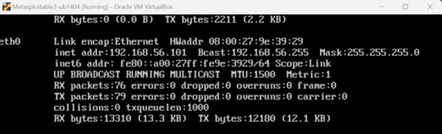

# 🛠️ Metasploitable3 Installation Guide

This guide provides a **step-by-step walkthrough** for installing **Metasploitable 3** (Ubuntu 14.04 version) as a pre-built OVA file using **Oracle VirtualBox**.

---

## 🖼️ Metasploitable3 IP Address

Below is the screenshot showing the output of `ip a` from the victim machine:



---

## ✅ Prerequisites

Before you begin, make sure the following are ready:

- **Oracle VirtualBox:**  
  [Download VirtualBox](https://www.virtualbox.org/)

- **Metasploitable3 OVA file:**  
  [Download from SourceForge](https://sourceforge.net/projects/metasploitable3-ub1404upgraded/files/)

> ℹ️ *Note: The OVA file is a pre-configured virtual machine, which saves time compared to manual setup.*

---

## 🚀 Installation Steps

### 1️⃣ Launch VirtualBox

- Open **Oracle VM VirtualBox** on your machine.

---

### 2️⃣ Import the OVA File

- Navigate to:  
  **File → Import Appliance**
  
- Click **Browse**, and select the downloaded `.ova` file.

- Click **Next**, review settings, and then **Import**.

> 💡 *Tip: It may take several minutes to import, depending on your system's performance.*

---

### 3️⃣ Configure Network Settings

To ensure your testing environment is isolated and manageable:

- Right-click the imported **Metasploitable3 VM** → **Settings** → **Network.**

- Set **Adapter 1** to:  
  **Attached to:** `Host-Only Adapter`  
  *(This isolates the VM from the internet but keeps it accessible to your attacker machine.)*

---

### 4️⃣ Start the VM

- Select the Metasploitable3 VM and click **Start.**

- Log in with the default credentials:  
  **Username:** `vagrant`  
  **Password:** `vagrant`

---

## 🔍 Verifying Network Setup

Once the VM is running:

1. Inside **Metasploitable3**, run:
   ```bash
   ifconfig
