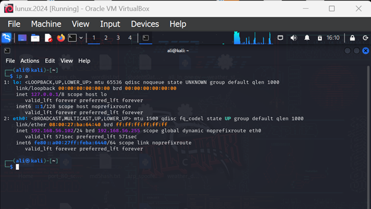

# 🚩 Phase 1: Attack Execution

This document Show a **detailed step-by-step guide** to compromising the **Metasploitable3** machine via:

1. ✅ **Task 1.1:** Using Metasploit framework.
2. ✅ **Task 1.2:** Using a custom Python script.

---

## 🌐 Network Information

- **Victim (Metasploitable3) IP:** `192.168.56.101`


- **Attacker (Kali Linux) IP:** `192.168.56.102`


---

# ✅ Task 1.1: Compromise Using Metasploit

In this task, we targeted the **SSH service (port 22)** on Metasploitable3 using **Metasploit's brute-force module.**

---

## 🔧 Step 1: Launch Metasploit

Open the terminal on your Kali machine and run:

```bash
msfconsole

🔧 Step 2: Select the SSH Login Module
We are using the ssh_login module, which performs brute-force attacks on SSH:

bash
Copy
Edit
use auxiliary/scanner/ssh/ssh_login