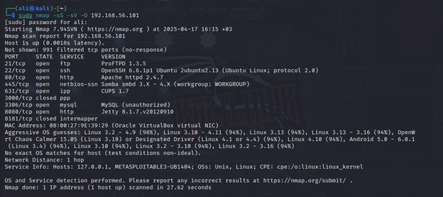
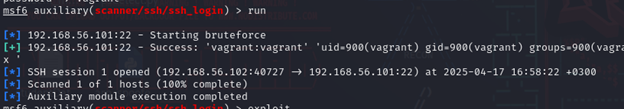
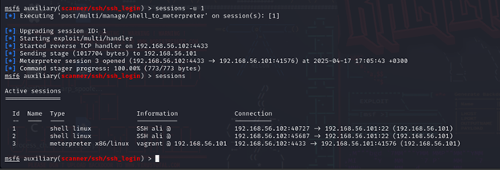
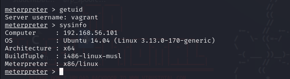
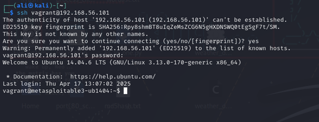
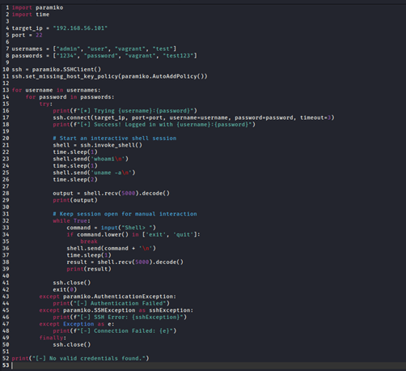
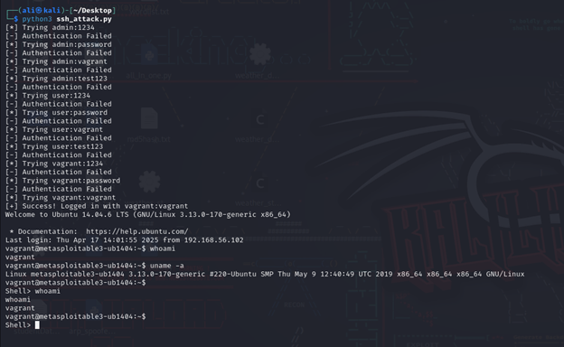

# 🚩 Phase 1: Attack Execution

This document Show a **detailed step-by-step guide** to compromising the **Metasploitable3** machine via:

1. ✅ **Task 1.1:** Using Metasploit framework.
2. ✅ **Task 1.2:** Using a custom Python script.

---

## 🌐 Network Information

- **Victim (Metasploitable3) IP:** `192.168.56.101`


- **Attacker (Kali Linux) IP:** `192.168.56.102`


---

## 🔍 Task 1.1: Using Metasploit Framework

We performed an SSH brute-force attack using the Metasploit framework.

---


## 🔎 Nmap Scan: Identifying Open Ports and OS

Before launching the attack, we performed reconnaissance to identify open ports and gather OS information of the victim machine (`192.168.56.101`).

### 🔧 **Nmap Command Used:**

```bash
sudo nmap -sS -sV -O 192.168.56.101
```



---

### **Commands Used:**

we will target SSH_port 22 using Brute_force

```bash
msfconsole
use auxiliary/scanner/ssh/ssh_login
show options
set pass_file /usr/share/wordlists/metasploit/unix_passwords.txt
set user_file /usr/share/wordlists/metasploit/unix_users.txt
set rhosts 192.168.56.101
exploit
```



- Credentials found: `vagrant:vagrant`.


---

### **Upgrading the shell to meterpreter:**



---
### **Post-exploitation:**



---

### **Log-in using SSH port:**



---

## 🛠️ Task 1.2: Using a Custom Python Script

In this task, we developed a **custom Python script** to automate the brute-force attack on the SSH service of the Metasploitable3 machine (`192.168.56.101`).

### 🔧 **Script Overview:**

- The script uses the `paramiko` library to attempt SSH logins.
- It iterates over a list of username and password combinations.
- On successful login, it opens an interactive shell session.

### 📝 **Custom Script Code:**



---

### 🖥️ **Script Execution Proof**

The screenshot below shows the execution of our custom Python script (`ssh_attack.py`) on the attacker machine. The script iterated through multiple username and password combinations, and upon finding valid credentials (`vagrant:vagrant`), successfully established an SSH session with the victim machine (`192.168.56.101`).

✅ **Key Observations:**

- Multiple failed login attempts were handled gracefully.
- Successful login output confirms access to the victim machine.
- Commands like `uname -a` and `whoami` were executed to demonstrate shell access.


