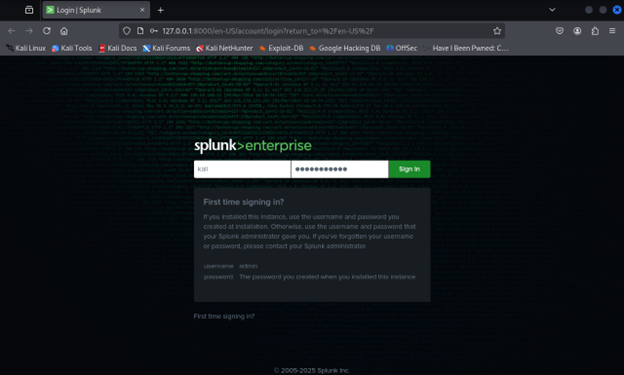
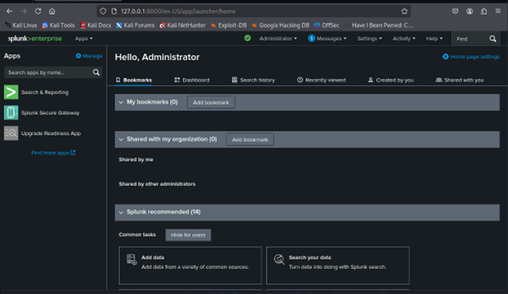
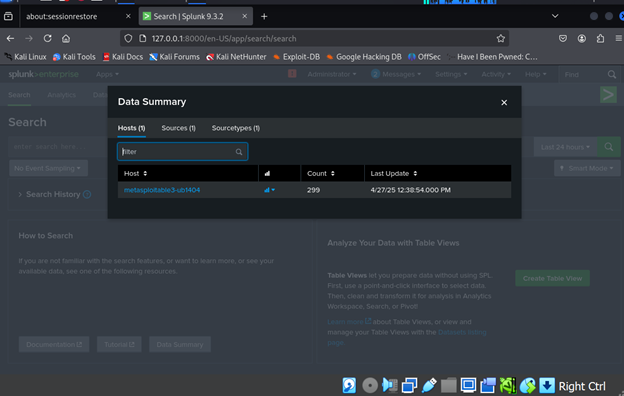
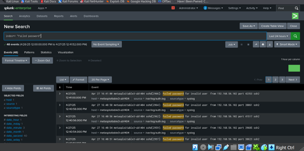
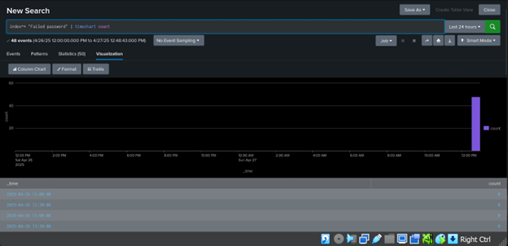
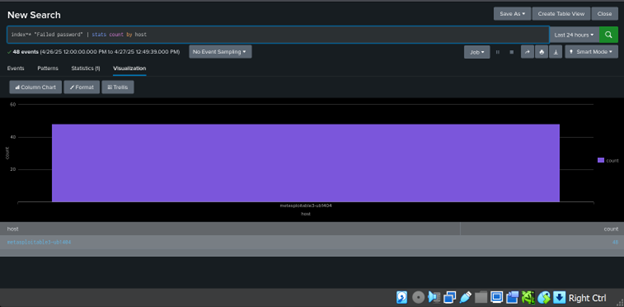

# 📊 Phase 2: SIEM Dashboard Analysis

In this phase, we used a **SIEM (Security Information and Event Management)** platform to collect, visualize, and analyze logs from the victim machine. We chose **Splunk** as our SIEM tool to track and investigate the SSH brute-force attacks launched in Phase 1.

---

## 🔧 Splunk Installation and Setup

We installed **Splunk Enterprise v9.3.2** on the Virtual machine to collect and monitor logs from Victim.


### **Installation Commands:**

```bash
wget -O splunkforwarder-9.4.1-amd64.deb "https://download.splunk.com/products/universalforwarder/releases/9.4.1/linux/splunkforwarder-9.4.1-e3bdab203ac8-linux-amd64.deb"

sudo dpkg -i splunk-9.4.1-e3bdab203ac8-linux-amd64.deb
```

**Start Splunk for the First Time:**

```bash
sudo /opt/splunk/bin/splunk start --accept-license
```



---

### **Install and Configure Splunk Universal Forwarder:**

   ```bash
   wget -O splunkforwarder-9.4.1-e3bdab203ac8-linux-arm64.deb "https://download.splunk.com/products/universalforwarder/releases/9.4.1/linux/splunkforwarder-9.4.1-e3bdab203ac8-linux-arm64.deb"
   ```

**Install the Forwarder Package:**
   ```bash
   sudo dpkg -i splunkforwarder-9.4.1-e3bdab203ac8-linux-arm64.deb
   ```
**Start Splunk Forwarder and Accept the License:**
   ```bash
   sudo /opt/splunkforwarder/bin/splunk start --accept-license
   ```

**Verify the Setup**
**Check the Forwarder Status:**
   ```bash
   sudo /opt/splunkforwarder/bin/splunk list forward-server
   ```


- the logs has been sent to Splunk:


---

**Check the logs after the attack**

- As we can see, the number of logs is increased 


- Show the Failed password logs:



-  Visualize the attacks
* index=* "Failed password" | timechart count:


* index=* "Failed password" | stats count by host:



