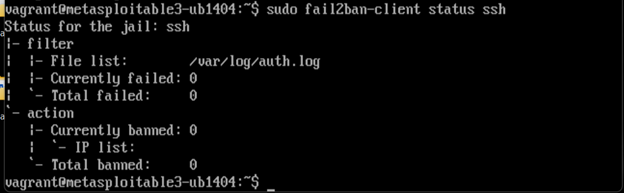
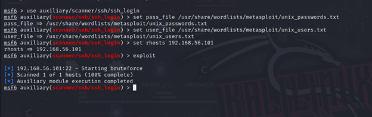
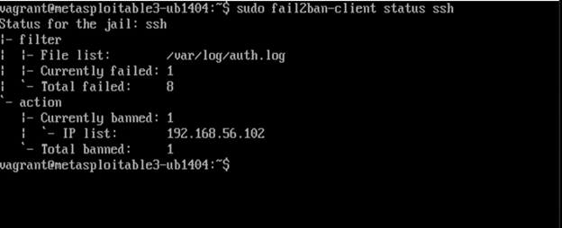

# 🛡️ Phase 3: Defensive Strategy Proposal

In Phase 3, we implemented a **defensive mechanism** to protect the victim machine from brute-force SSH attacks. We chose to deploy **Fail2Ban**, a well-known intrusion prevention tool that monitors log files and bans IP addresses exhibiting malicious behavior.

---

## 🎯 Objective

Our goal was to:

- **Mitigate brute-force SSH attacks** targeting the victim machine.
- **Rerun the attack** from Phase 1 to confirm that our defense strategy effectively blocks unauthorized access.
- **Demonstrate a before-and-after comparison** to show improved security.

---

## 🔧 Fail2Ban Installation and Configuration

We installed **Fail2Ban** on the victim machine (`192.168.56.101`) and configured it to monitor SSH login attempts.

### **Installation Commands:**

```bash
sudo apt-get update
sudo apt-get install fail2ban -y
```

---
### **Before the Attack The jail ssh is active:**

- Currently failed: 0 and Currently banned: 0 → everything is ready and waiting



---

### 🛠️ **Attack Execution**

We executed the same brute-force attack as in Phase 1, targeting SSH port 22 on the victim machine (`192.168.56.101`).



- As we can see the attack is not complete and not showing anything

## ✅ Fail2Ban Result

- let's see the Jail in fail2ban


* Currently banned: 1
* IP list: 192.168.56.102
* Total failed attempts: 8
- This confirms that the IP was banned
